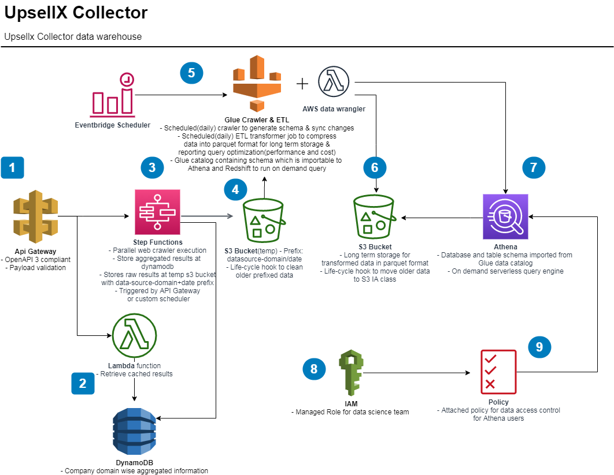

### upsellx

#### TODO

- [x] REST API
- [x] Web Crawlers(2)
- [x] Parallelization
- [x] NoSQL Database
- [x] ETL
- [x] Pipeline Scheduler

### Deployment(sam-cli)
Run following commands from the top level directory of the repo to build layer and deploy the app.
```bash
docker run --rm -v $PWD:/usr/app node:12 bash -c "cd /usr/app/layers/node/nodejs/ && npm install"
docker run --rm -v $PWD:/usr/app python:3.8 bash -c "pip install -r /usr/app/layers/py/python/requirements.txt --target /usr/app/layers/py/python/ --no-cache-dir"
sam deploy --guided
```

### Usage
* Api doc [here](https://app.swaggerhub.com/apis/k-hasan-19/upsellx/0.2.0)
* Api summary: After submiting the crawling job using `POST` you query company data using the `GET` API. Endpoint accepts *FQDN*/`hostname`  
* To query data at temporary bucket goto **Athena** console and select `upsellxtemp` database
* Scheduler will compress data everyday in parquet && will append to `upsellxsilo` database. To access it early run `aws-data-wrangler` lambda function from aws console.
## Architecture


